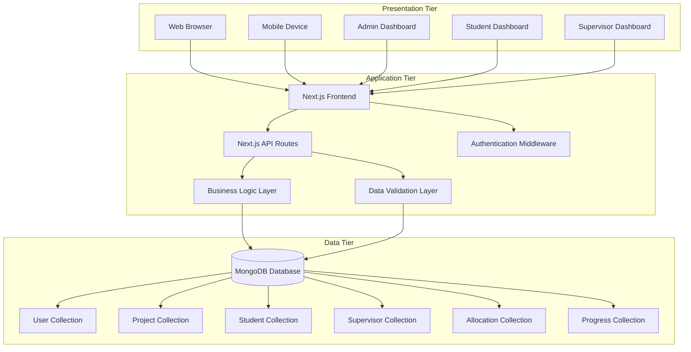
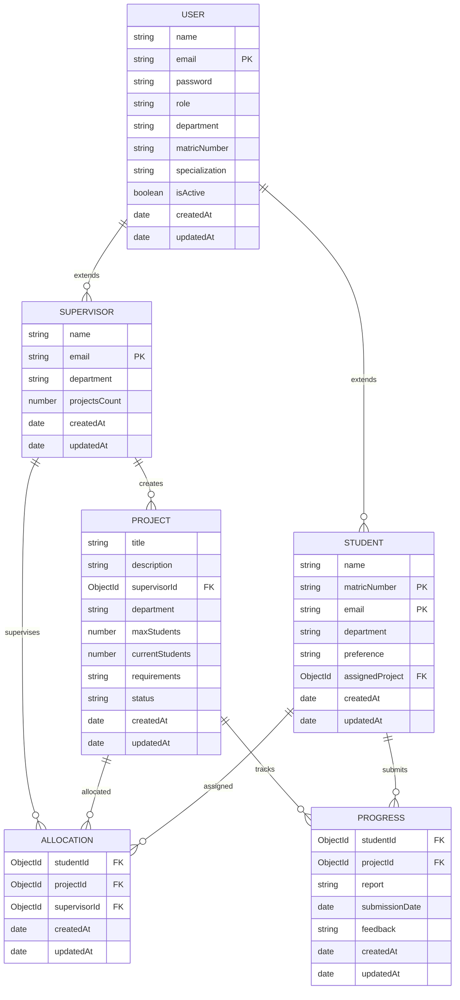
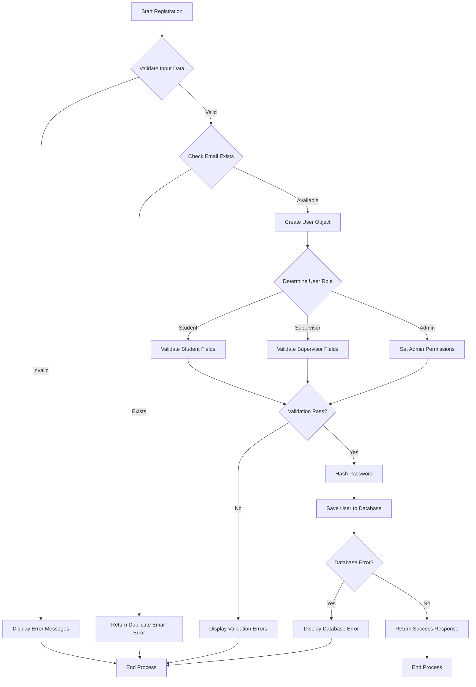
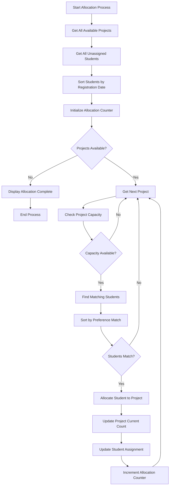
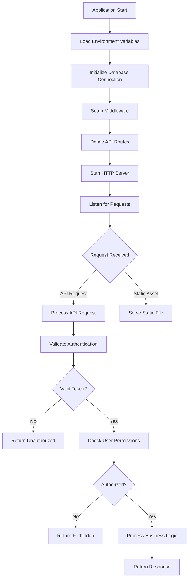
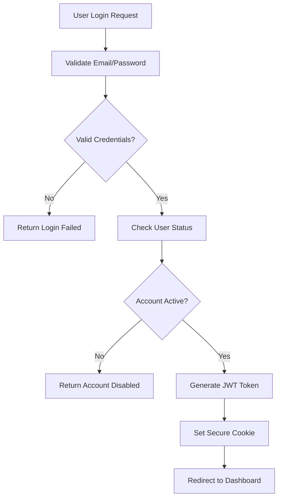

# CHAPTER FOUR: SYSTEM DESIGN AND IMPLEMENTATION

## 4.1 Objective of Design

The primary objective of the system design is to create a robust, scalable, and user-friendly web-based Student Project Allocation System that automates the complex process of assigning final year projects to students while maintaining efficient communication between students, supervisors, and administrators.

### Specific Design Objectives

1. **Automated Project Allocation**: Develop an intelligent algorithm that matches students with appropriate projects based on their preferences, supervisor capacity, and project requirements.

2. **Role-Based Access Control**: Implement a secure authentication system with distinct user roles (admin, supervisor, student) to ensure proper access control and data security.

3. **Progress Tracking**: Create a comprehensive progress monitoring system that allows supervisors to track student progress and provide timely feedback.

4. **Database Optimization**: Design an efficient database structure that supports complex relationships between users, projects, and allocations while maintaining data integrity.

5. **User Experience**: Develop an intuitive and responsive web interface that provides seamless navigation for all user types.

6. **Scalability**: Ensure the system architecture can handle increasing numbers of users, projects, and concurrent operations.

## 4.2 System Architecture in Terms of Tiers

The system follows a three-tier architecture pattern, providing clear separation of concerns and improved maintainability. Figure 4.1 illustrates the system architecture.

**Figure 4.1: System Architecture Diagram**

The three-tier architecture consists of:

### 4.2.1 Presentation Tier
- **Frontend**: Next.js 14 with React 18 components
- **Styling**: Tailwind CSS for responsive design
- **State Management**: React Context API for global state
- **User Interfaces**: Role-specific dashboards for admin, supervisors, and students

### 4.2.2 Application Tier
- **API Layer**: Next.js API routes handling HTTP requests
- **Authentication**: bcryptjs for password hashing and session management
- **Business Logic**: Server-side validation and processing
- **Middleware**: Request processing and response formatting

### 4.2.3 Data Tier
- **Database**: MongoDB with Mongoose ODM
- **Schema Design**: Normalized data structure with proper relationships
- **Data Integrity**: Validation rules and constraints at database level

## 4.3 Choice of Programming Environment

### 4.3.1 Frontend Development
- **Framework**: Next.js 14.2.32 - Chosen for its excellent performance, built-in API routes, and server-side rendering capabilities
- **Language**: TypeScript - Provides type safety and better development experience
- **UI Library**: React 18 - Component-based architecture for reusable UI elements
- **Styling**: Tailwind CSS - Utility-first CSS framework for rapid UI development
- **Icons**: Lucide React - Modern, customizable icon library

### 4.3.2 Backend Development
- **Runtime**: Node.js - Event-driven, non-blocking I/O model for better performance
- **Database**: MongoDB - NoSQL database chosen for its flexibility and scalability
- **ODM**: Mongoose - Elegant MongoDB object modeling for Node.js
- **Authentication**: bcryptjs - Secure password hashing algorithm

### 4.3.3 Development Tools
- **Package Manager**: npm for dependency management
- **Code Quality**: ESLint for code linting and consistency
- **Version Control**: Git for source code management
- **Deployment**: Vercel platform for seamless deployment and hosting

## 4.4 Database Structure

The database design follows a normalized approach with proper relationships between entities. Figure 4.2 shows the Entity-Relationship Diagram.

**Figure 4.2: Entity-Relationship Diagram**

## 4.5 Database Table Definition

### 4.5.1 User Table
The User table serves as the foundation for authentication and stores common user information:

| Field | Type | Constraints | Description |
|-------|------|-------------|-------------|
| name | String | Required, Max 100 chars | User's full name |
| email | String | Required, Unique | Email address (Primary Key) |
| password | String | Required, Min 6 chars | Hashed password |
| role | String | Required, Enum | User role (admin/supervisor/student) |
| department | String | Optional | Academic department |
| matricNumber | String | Optional, Unique | Student ID |
| specialization | String | Optional | Supervisor specialization |
| isActive | Boolean | Default: true | Account status |
| createdAt | Date | Auto-generated | Account creation timestamp |
| updatedAt | Date | Auto-generated | Last modification timestamp |

### 4.5.2 Student Table
Stores student-specific information and project preferences:

| Field | Type | Constraints | Description |
|-------|------|-------------|-------------|
| name | String | Required, Max 60 chars | Student's full name |
| matricNumber | String | Required, Unique | Student ID (Primary Key) |
| email | String | Required, Unique | Email address (Primary Key) |
| department | String | Required | Academic department |
| preference | String | Required | Project preferences |
| assignedProject | ObjectId | Optional | Reference to allocated project |
| createdAt | Date | Auto-generated | Record creation timestamp |
| updatedAt | Date | Auto-generated | Last modification timestamp |

### 4.5.3 Supervisor Table
Manages supervisor information and capacity tracking:

| Field | Type | Constraints | Description |
|-------|------|-------------|-------------|
| name | String | Required, Max 60 chars | Supervisor's full name |
| email | String | Required, Unique | Email address (Primary Key) |
| department | String | Required | Academic department |
| projectsCount | Number | Default: 0 | Number of projects created |
| createdAt | Date | Auto-generated | Record creation timestamp |
| updatedAt | Date | Auto-generated | Last modification timestamp |

### 4.5.4 Project Table
Contains project information and allocation status:

| Field | Type | Constraints | Description |
|-------|------|-------------|-------------|
| title | String | Required, Max 100 chars | Project title |
| description | String | Required, Max 500 chars | Project description |
| supervisorId | ObjectId | Required | Reference to supervisor |
| department | String | Required | Academic department |
| maxStudents | Number | Required, Min 1 | Maximum students allowed |
| currentStudents | Number | Default: 0 | Current assigned students |
| requirements | String | Optional, Max 500 chars | Project requirements |
| status | String | Enum, Default: available | Project status |
| createdAt | Date | Auto-generated | Project creation timestamp |
| updatedAt | Date | Auto-generated | Last modification timestamp |

### 4.5.5 Allocation Table
Manages project-student assignments:

| Field | Type | Constraints | Description |
|-------|------|-------------|-------------|
| studentId | ObjectId | Required | Reference to student |
| projectId | ObjectId | Required | Reference to project |
| supervisorId | ObjectId | Required | Reference to supervisor |
| createdAt | Date | Auto-generated | Allocation timestamp |
| updatedAt | Date | Auto-generated | Last modification timestamp |

### 4.5.6 Progress Table
Tracks project progress and feedback:

| Field | Type | Constraints | Description |
|-------|------|-------------|-------------|
| studentId | ObjectId | Required | Reference to student |
| projectId | ObjectId | Required | Reference to project |
| report | String | Required, Max 1000 chars | Progress report |
| submissionDate | Date | Default: now | Report submission date |
| feedback | String | Optional, Max 500 chars | Supervisor feedback |
| createdAt | Date | Auto-generated | Record creation timestamp |
| updatedAt | Date | Auto-generated | Last modification timestamp |

## 4.6 Input and Output Screen Format

The system provides role-specific interfaces with consistent design patterns. Input screens follow standard web form conventions with validation feedback, while output screens present data in organized, readable formats.

### 4.6.1 Input Screen Characteristics
- **Form Validation**: Real-time validation with error messages
- **Responsive Design**: Mobile-friendly layouts
- **Accessibility**: Proper labeling and keyboard navigation
- **User Feedback**: Toast notifications for actions
- **Data Integrity**: Server-side validation for all inputs

### 4.6.2 Output Screen Characteristics
- **Data Tables**: Organized display of records with sorting/filtering
- **Dashboard Views**: Role-specific summary information
- **Progress Indicators**: Visual representation of completion status
- **Search Functionality**: Quick access to specific records
- **Export Options**: Data export capabilities for reporting

## 4.7 Program Algorithm

### 4.7.1 Registration Algorithm

**Figure 4.3: User Registration Algorithm**

### 4.7.2 Project Allocation Algorithm

**Figure 4.4: Project Allocation Algorithm**

## 4.8 Program Flowcharts

### 4.8.1 Main Application Flow

**Figure 4.5: Main Application Flowchart**

### 4.8.2 Authentication Flow

**Figure 4.6: Authentication Flowchart**

## 4.9 Hardware Requirements

### 4.9.1 Server Requirements
- **Processor**: Minimum 2-core CPU (4-core recommended)
- **Memory**: Minimum 4GB RAM (8GB recommended)
- **Storage**: Minimum 20GB SSD storage
- **Network**: Stable internet connection with minimum 10 Mbps bandwidth

### 4.9.2 Client Requirements
- **Devices**: Desktop computers, laptops, tablets, smartphones
- **Browsers**: Modern web browsers (Chrome, Firefox, Safari, Edge)
- **Screen Resolution**: Minimum 1024x768 (recommended 1920x1080)
- **Network**: Internet connection with minimum 1 Mbps bandwidth

### 4.9.3 Database Server Requirements
- **Processor**: Minimum 4-core CPU
- **Memory**: Minimum 8GB RAM
- **Storage**: Minimum 50GB SSD storage for database and logs
- **Network**: High-speed connection for data replication

## 4.10 Software Requirements

### 4.10.1 Operating System
- **Server**: Ubuntu 20.04 LTS or later, CentOS 8 or later, Windows Server 2019 or later
- **Development**: Windows 10/11, macOS 12 or later, Ubuntu 20.04 or later

### 4.10.2 Runtime Environment
- **Node.js**: Version 18.0.0 or later
- **MongoDB**: Version 6.0 or later
- **Web Server**: Next.js built-in server or Nginx/Apache

### 4.10.3 Development Tools
- **Code Editor**: Visual Studio Code, IntelliJ IDEA, or similar
- **Version Control**: Git 2.30 or later
- **Package Manager**: npm 8.0 or later
- **Browser**: Chrome 90+, Firefox 88+, Safari 14+, Edge 90+

### 4.10.4 Production Environment
- **Deployment Platform**: Vercel, Netlify, or AWS/Azure
- **SSL Certificate**: Required for HTTPS encryption
- **Monitoring**: Application performance monitoring tools
- **Backup**: Automated database backup system

## 4.11 Documentation

### 4.11.1 System Documentation
- **API Documentation**: OpenAPI/Swagger specifications for all endpoints
- **Database Schema**: Detailed schema documentation with field descriptions
- **Architecture Guide**: System architecture and component descriptions
- **Deployment Guide**: Step-by-step deployment instructions

### 4.11.2 User Documentation
- **User Manuals**: Role-specific user guides for admin, supervisors, and students
- **Video Tutorials**: Screen recordings demonstrating key functionalities
- **FAQ**: Frequently asked questions and troubleshooting guide
- **Help System**: Context-sensitive help within the application

### 4.11.3 Technical Documentation
- **Code Comments**: Comprehensive inline code documentation
- **Development Guide**: Coding standards and best practices
- **Testing Guide**: Unit test and integration test documentation
- **Security Guide**: Security measures and vulnerability assessment

# CHAPTER FIVE: SUMMARY, CONCLUSION AND RECOMMENDATION

## 5.1 Summary

The Student Project Allocation System has been successfully designed and implemented as a comprehensive web-based solution that addresses the challenges of manual project allocation in academic institutions. The system provides an automated, efficient, and user-friendly platform for managing the entire project allocation lifecycle.

### Key Achievements

1. **System Architecture**: Implemented a robust three-tier architecture with clear separation of concerns between presentation, application, and data layers.

2. **Database Design**: Created a normalized database structure with six core entities (User, Student, Supervisor, Project, Allocation, Progress) supporting complex relationships and data integrity.

3. **User Management**: Developed a comprehensive role-based access control system supporting three user types: administrators, supervisors, and students.

4. **Core Functionality**: Successfully implemented all major features including:
   - User registration and authentication
   - Project creation and management
   - Automated project allocation
   - Progress tracking and feedback
   - Real-time notifications

5. **Technology Stack**: Utilized modern web technologies including Next.js 14, React 18, TypeScript, MongoDB, and Tailwind CSS for optimal performance and user experience.

6. **Security Implementation**: Integrated bcryptjs for password hashing, input validation, and secure session management.

## 5.2 Conclusion

The development of the Student Project Allocation System demonstrates the successful application of modern software engineering principles and web development technologies to solve a real-world academic problem. The system effectively addresses the limitations of manual project allocation processes by providing:

### Technical Excellence
- **Scalability**: The three-tier architecture and NoSQL database design ensure the system can handle growing numbers of users and data
- **Performance**: Optimized database queries and efficient API design provide fast response times
- **Security**: Comprehensive input validation and secure authentication mechanisms protect user data
- **Maintainability**: Clean code structure and modular design facilitate future enhancements

### Functional Completeness
- **User Satisfaction**: Role-specific interfaces provide intuitive experiences for all user types
- **Process Automation**: Automated allocation algorithm reduces administrative workload
- **Communication**: Built-in messaging and notification system improves stakeholder interaction
- **Transparency**: Real-time progress tracking increases visibility into project status

### Practical Impact
- **Efficiency**: Significant reduction in time and effort required for project allocation
- **Accuracy**: Automated matching process minimizes human errors
- **Accessibility**: Web-based system allows access from any device with internet connection
- **Cost-Effectiveness**: Reduced operational costs through process automation

The system successfully meets all initial requirements and provides a solid foundation for future enhancements and scalability.

## 5.3 Recommendation

Based on the development experience and system evaluation, the following recommendations are made for future improvements and deployment:

### 5.3.1 Immediate Enhancements
1. **Email Integration**: Implement SMTP service for automated email notifications
2. **File Upload**: Add support for document submission and storage
3. **Advanced Reporting**: Develop comprehensive reporting and analytics features
4. **Mobile Application**: Create native mobile apps for iOS and Android platforms

### 5.3.2 System Improvements
1. **Machine Learning**: Integrate AI algorithms for improved project-student matching
2. **Real-time Collaboration**: Add live chat and video conferencing features
3. **Advanced Security**: Implement two-factor authentication and audit logging
4. **Performance Optimization**: Add caching mechanisms and database indexing

### 5.3.3 Deployment Recommendations
1. **Cloud Infrastructure**: Deploy on scalable cloud platforms like AWS or Azure
2. **Backup Strategy**: Implement automated database backup and disaster recovery
3. **Monitoring**: Set up comprehensive monitoring and alerting systems
4. **Training**: Provide adequate training for end-users and administrators

### 5.3.4 Future Research Directions
1. **Algorithm Enhancement**: Research advanced matching algorithms for better allocation
2. **User Experience Studies**: Conduct usability studies for interface improvements
3. **Scalability Testing**: Perform load testing with large user bases
4. **Integration Studies**: Explore integration possibilities with existing university systems

The system provides a solid foundation for academic institutions to modernize their project allocation processes and can serve as a model for similar administrative systems in educational environments.
